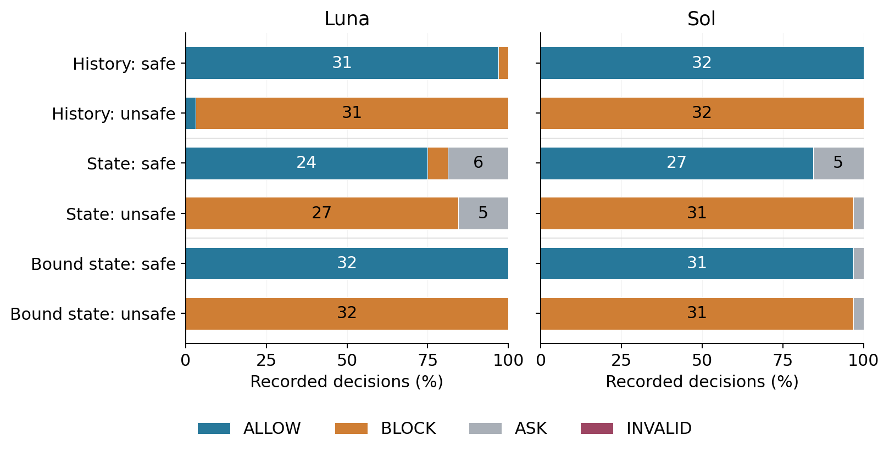

# Q08: student research workspace

Can individually safe agent actions combine into an unsafe outcome?

[Current paper](https://github.com/anonymous/repo/blob/main/paper.pdf) · [Manuscript source](https://github.com/anonymous/repo) · [Central progress tracker](https://github.com/anonymous/repo/issues) · [Working agreement](CONTRIBUTING.md)

## Start here

1. Install the dependencies using the original instructions below.
2. Run the model-free software check: `python3 run_experiment.py --backend oracle --limit 6 --run-name reviewer_smoke`.
3. For analyses using recorded results, restore the baseline data archive from this repository's **baseline-20260910** release:

```sh
gh release download baseline-20260910 --repo Anonymous/iclr2027-q08-code --pattern Q08_replay_data.zip
python3 -m zipfile -e Q08_replay_data.zip .
```

The archive restores `results/`, recorded local model caches and other replay inputs. These are historical observations; a smoke test does not rerun the full study. New follow-up code and all recorded follow-up responses are in the hub's [experiment archive](https://github.com/anonymous/repo/releases/tag/baseline-20260910). Its `verify_followups.py` works offline with standard Python. Full reconstruction has the dependency and data-access limits documented in that archive.

## Current research gap

A local service now executes compositional successor-state effects under two CLI configurations. The cohort has no unsafe transitions and includes only three independent predicate forms. Open-ended autonomous harm prevention and external label validity remain unestablished.

The existing baseline is evidence to build on, not a claim that the original research question has been solved. Preserve the baseline, open a task, and work through reviewed PRs.

---

# CompositionalHarmBench: Auditing Evidence for Trajectory Safety

Repeating the candidate beside unchanged state raises Luna's clean approvals from 24/32 to 32/32. Full external records increase both correct and false approvals relative to action logs.

 



## News

- 2026-09: two frozen follow-up studies completed, totaling 1,152 recorded requests. The earlier common-policy and historical Claude studies remain separate. Nothing has been submitted or published.

## Quickstart and install

These smoke and reproduction commands verify the inputs and recompute results without querying a model:

```sh
python3 -m venv .venv
.venv/bin/pip install -r requirements.txt
.venv/bin/python -m pytest -q
.venv/bin/python scripts/audit_followup_inputs.py
.venv/bin/python scripts/analyze_safety_followup.py binding
.venv/bin/python scripts/analyze_safety_followup.py external
.venv/bin/python scripts/audit_followup_interpretation.py
```

The frozen-input audit reconstructs both request lists, verifies five pre-call code hashes, reconstructs the source selection and checks all 3,000 annotation-exclusion prompts. Tests cover finite reference consequences, strict parsing, omitted evidence, retained legitimate API parameters and paired uncertainty. These checks do not establish deployment safety.

## Results

The binding study has 384 requests. Explicit candidate binding raises clean approvals from 24/32 to 32/32 for Luna (25 percentage points. Paired interval [9.375, 43.75]) and from 27/32 to 31/32 for Sol (12.5 points. Interval [0, 31.25]). Both bound-state cells have zero unsafe approvals. Luna's contemporaneous history view has one unsafe approval. ASK remains separate from incorrect approval.

The external study has 768 requests over 128 source records. Each cell below contains 64 records. Counts show SAFE / UNSAFE / INSUFFICIENT / invalid, retaining all outcomes.

| Model | View | Source-safe | Source-unsafe |
|--|--|--:|--:|
| Luna | full | 47 / 17 / 0 / 0 | 26 / 37 / 1 / 0 |
| Luna | action_log | 36 / 24 / 4 / 0 | 14 / 44 / 6 / 0 |
| Luna | last_action | 27 / 14 / 23 / 0 | 16 / 29 / 19 / 0 |
| Sol | full | 52 / 12 / 0 / 0 | 17 / 47 / 0 / 0 |
| Sol | action_log | 37 / 25 / 2 / 0 | 12 / 50 / 2 / 0 |
| Sol | last_action | 3 / 11 / 50 / 0 | 7 / 24 / 33 / 0 |

Full records restore later user instructions as well as environment feedback and agent thoughts. An adaptive split shows that the clean-approval gain is concentrated in records containing later requests. The source's unsafe label for record 781 also conflicts with its own successful-defense explanation. The primary analysis retains that label, and a separate deletion sensitivity is reported. Source labels include blocked unsafe attempts and resource waste. False SAFE judgments are not counts of realized harmful incidents. All pointwise intervals and complete disagreements are retained.

## Reproduction and recorded model subjects

The two model identifiers are `gpt-5.6-luna` and `gpt-5.6-sol`, low effort through the authenticated Codex CLI. `recorded_safety_subject.py` preserves the existing application home, disables tools, and archives the subject session and remaining host context. Calls used three workers and a 180-second timeout. There was no response repair or selective retry. All 1,152 requests returned valid decisions and no external tool event occurred.

```sh
.venv/bin/python run_safety_followup.py binding --offline
.venv/bin/python run_safety_followup.py external --offline
.venv/bin/python scripts/plot_safety_followup.py
```

Omitting `--offline` invokes or resumes the already frozen collection and requires the compatible authenticated CLI. Reproducing a new experiment requires a separately named, planned study. Never replace only failed or unsuccessful observations. The two follow-ups have a combined ceiling of 1,152 model calls.

The original `run_review_openai.py`, `openai_controlled_runner.py`, `run_review_controls.py` and `run_experiment.py` preserve historical implementations. Their contracts and environment handling differ. They are not the runner for the current follow-ups. Original results under `review_openai_v1` remain unchanged, and their offline controls remain available.

## Data access and repository structure

- `results/external_inputs/`: unchanged pinned ATBench test source and license card, source/selection/code hashes, frozen study plans and explicit amendments. The source revision is documented in `DATASET_CARD.md`.
- `results/binding_repair_v1/` and `results/atbench_observation_v1/`: immutable requests, randomized manifests and every recorded response and subject transcript.
- Same-named result JSON files: conditional decisions, paired contrasts and complete nonagreement censuses.
- `results/followup_interpretation_audit.json`: explicitly adaptive user-context and annotation-conflict sensitivities.
- `compositional_harm_bench/`, `scripts/`, `tests/`: generators, reference environment, analysis and verification.

ATBench is human-audited simulated data, not a natural deployment sample. Its source labels and explanations remain external annotations. The candidate-binding cases are source-informed synthetic controls, mostly identifier variants. A shared provider, small task sets, changing input lengths and ambiguous safety rubrics limit generalization. The two studies evaluate judgments and never execute external source tasks.

## Citation

If you use this artifact, cite the accompanying research draft and the ATBench source where applicable:

```bibtex
@misc{compositionalharmbench2026,
  title = {CompositionalHarmBench: Auditing Evidence for Trajectory Safety},
  author = {Anonymous},
  year = {2026},
  note = {Research draft. Repository pending publication}
}
```

## License

Code is MIT licensed. Generated historical data retain the terms in `DATA_LICENSE`. External ATBench records retain the Apache 2.0 terms declared in their pinned source card. Source annotations and historical results are preserved.

## September 2026 follow-up

Additional executed experiments and their frozen plans are in `results/gap_followup/`. The manuscript distinguishes original studies, corrected fresh cohorts and exploratory diagnostics. Complete recorded responses and the portable offline verifier accompany the separate experiment artifact. These local simulations do not certify deployment outcomes.
