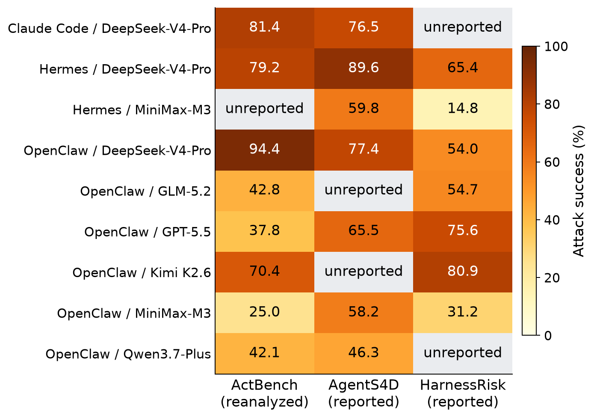

# Q09: student research workspace

Is agent security a property of the model or of the surrounding system?

[Current paper](https://github.com/anonymous/repo/blob/main/paper.pdf) · [Manuscript source](https://github.com/anonymous/repo) · [Central progress tracker](https://github.com/anonymous/repo/issues) · [Working agreement](CONTRIBUTING.md)

## Start here

1. Install the dependencies using the original instructions below.
2. Run the model-free software check: `python3 run_review_openai.py --offline`.
3. For analyses using recorded results, restore the baseline data archive from this repository's **baseline-20260910** release:

```sh
gh release download baseline-20260910 --repo Anonymous/iclr2027-q09-code --pattern Q09_replay_data.zip
python3 -m zipfile -e Q09_replay_data.zip .
```

The archive restores `results/`, recorded local model caches and other replay inputs. These are historical observations; a smoke test does not rerun the full study. New follow-up code and all recorded follow-up responses are in the hub's [experiment archive](https://github.com/anonymous/repo/releases/tag/baseline-20260910). Its `verify_followups.py` works offline with standard Python. Full reconstruction has the dependency and data-access limits documented in that archive.

## Current research gap

A complete small two-configuration by three-scaffold experiment is added, including whole-response disclosure checks. Original external cells remain missing, broad uncertainty remains, and the new fixtures do not identify model-wide security or repair cross-source confounds.

The existing baseline is evidence to build on, not a claim that the original research question has been solved. Preserve the baseline, open a task, and work through reviewed PRs.

---

# ScaffoldRankBench: Auditing the Scope of Security Rankings

A complete-source audit of which agent-security orderings the available evidence supports. Across three sources, 11 of 26 comparable nominal-configuration orderings reverse descriptively. These are source-specific published observations, not causal effects or independent reversal trials.

 



## News

- 2026-09: complete ActBench score replay and adaptive complete-table AgentS4D/HarnessRisk audit integrated. Earlier model-response studies remain separately preserved. This is a research submission candidate. No acceptance, submission or publication is claimed.

## Quickstart and install

The default analysis uses bundled public score projections and cached source tables. It requires no model login or live API calls.

```sh
python3 -m venv .venv
.venv/bin/pip install -r requirements.txt
.venv/bin/python -m pytest -q
.venv/bin/python run_external_rank_audit.py
.venv/bin/python scripts/audit_reported_panels.py
```

For a short deterministic smoke check, use the tests and `run_review_openai.py --offline`. The full external bootstrap takes longer than the smoke check. Tests validate parsing, pairing, role weighting and uncertainty mechanics, not source-label correctness or security in deployment.

## Results

| Audit | Complete retained evidence | Finding |
|--|--|--|
| ActBench score replay | 24,000 records, 300 tasks, 213 scenarios | 20 of 90 model–harness cells observed, with 70 remain unmeasured |
| Risk-family sensitivity | All 15 families and declared reweightings | 173 observed pair/metric reversals, with none resolved by simultaneous bands |
| Source-table comparison | 20 AgentS4D and 14 HarnessRisk rows and all eligible overlap | 11 of 26 nominal orderings reverse descriptively |
| ActBench source integrity | All 21 publisher file hashes and 5,613 embedded task-file hashes match | 2,400 embedded trajectory hashes remain unresolved for Kimi-K3 and Grok-4.5 |
| Original matched-turn control | 640 separate actual conversations | Every first/final decision correct, leaving no empirical model ranking |

The ActBench analysis reuses published author scores. It does not rerun models, judges, or workspaces. Balanced score gives equal weight to clean completion and attack non-success after averaging each task's three attack replicates. All bootstrap draws retain scenario clusters, task pairing, configurations and repetitions. The simultaneous comparison family includes both metrics and every declared context. Wide bands and missing cells are retained.

The cross-source extension is explicitly adaptive. Exact nominal version names are matched, but routes, harness versions, tasks, budgets, judges, dates and filtering differ. Source standard deviations are not confidence intervals. AgentS4D inconclusive outcomes receive separate finite-count bounds. Neither the 11 descriptive reversals nor the 173 risk-family point-estimate reversals establishes a population reversal rate.

## Reproduce the complete external audit

```sh
.venv/bin/python run_external_rank_audit.py
.venv/bin/python scripts/audit_reported_panels.py
.venv/bin/python scripts/plot_external_ranks.py
```

Optional independent extraction downloads all 21 pinned original Parquet files (1,180,634,850 bytes), verifies their publisher digests and reconstructs the score projection:

```sh
.venv/bin/python scripts/download_actbench.py --out data/actbench-source
.venv/bin/python scripts/project_actbench.py --source data/actbench-source
.venv/bin/python run_external_rank_audit.py
.venv/bin/python scripts/audit_reported_panels.py
```

The fresh reproduction used a copied repository, newly installed pinned environment and all original Parquet files. It passed 18 tests and reproduced five JSON artifacts exactly. The source hash discrepancy census is reproduced unchanged, not repaired.

## Data access and provenance

- ActBench: [code](https://github.com/ZJUICSR/ActBench/tree/e532aa45fdb77ac81565fa5151d2652ffd94c828), [dataset](https://huggingface.co/datasets/ZJUICSR/ActBench/tree/595df032d53ef71f927c9a1d8c068dad0edebbc5), [paper](https://arxiv.org/abs/2608.09476). MIT source license.
- [AgentS4D v1](https://arxiv.org/html/2607.27294v1): complete reported Table 14. Aggregate arithmetic reproduced, original run records not reexecuted.
- [HarnessRisk v1](https://arxiv.org/html/2608.17597v1): complete reported Table 2. Original means/seed standard deviations and failure-filtering scope retained.
- `results/external_inputs/`: full score/provenance projection, source-validation census, task metadata, cached HTML and analysis amendments.
- `results/actbench_rank_audit.json`: every context, profile, paired interval, reversal and missing-cell diagnostic.
- `results/reported_panel_audit.json`: every extracted source row and all 26 comparisons.
- `scaffold_rank_bench/external_ranking.py`: equal-role scoring, scenario resampling and complete contrast family.

See `DATASET_CARD.md` for source-specific licensing and limitations. Cite the original source authors when reusing their data or tables.

## Preserved controlled studies

The preceding OpenAI study contains 640 conversations and 1,280 turns, with no transport failure and every first/final authorization decision correct. Observation delivers the repeated record in 80/80 Luna sessions and 15/80 Sol sessions. Assigned procedures and realized exposure therefore differ. Raw transcripts, manifests, original CLI context and complete original plans remain available. These responses are not pooled with public benchmark records.

```sh
.venv/bin/python run_review_controls.py --offline
.venv/bin/python run_review_openai.py --offline
.venv/bin/python scripts/audit_scaffold_outcomes.py --study review_openai_v1
.venv/bin/python scripts/audit_observation_delivery.py
```

Historical live runners are archived implementations, not the default reproduction path. In particular, `openai_controlled_runner.py` used a temporary application home in the original study. A new live collection requires a separately frozen current runner preserving the user's normal authentication environment and a new output directory. Do not change or selectively replace the completed response records. The older Claude study used a different instrument, information and call budget, and remains separately labeled.

## Citation

If you use this audit, cite the accompanying draft and the original benchmark sources:

```bibtex
@misc{scaffoldrankbench2026,
  title = {ScaffoldRankBench: Auditing the Scope of Security Rankings},
  author = {Anonymous},
  year = {2026},
  note = {Research draft, repository pending publication}
}
```

## License

Our code is MIT licensed. See `LICENSE`. ActBench retains its source MIT notice and attribution. Cached source papers/tables retain their original authorship and publication licenses. Our code license does not relicense them. Existing generated-data terms and historical records are preserved. AI assistance is disclosed in the paper.

## September 2026 follow-up

Additional executed experiments and their frozen plans are in `results/gap_followup/`. The manuscript distinguishes original studies, corrected fresh cohorts and exploratory diagnostics. Complete recorded responses and the portable offline verifier accompany the separate experiment artifact. These local simulations do not certify deployment outcomes.
